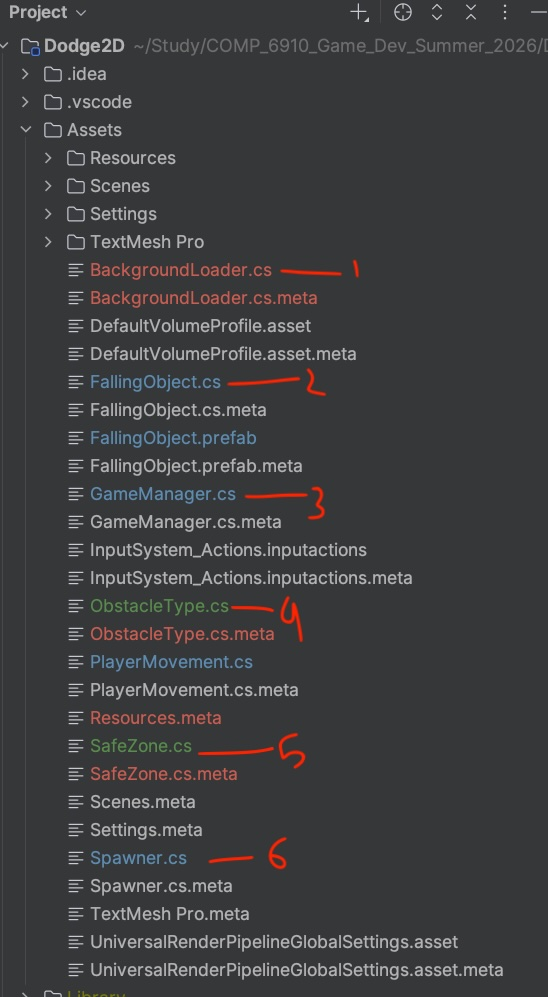
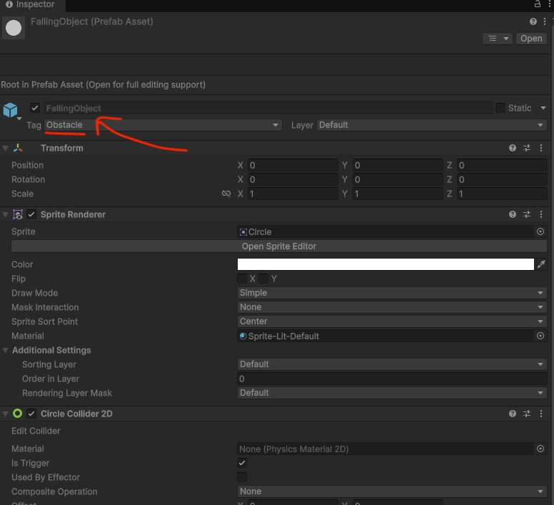
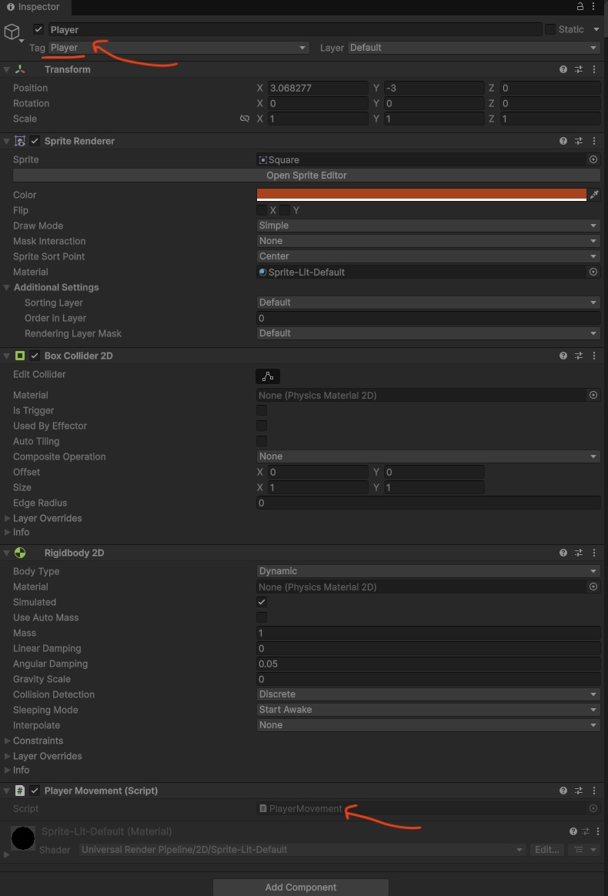
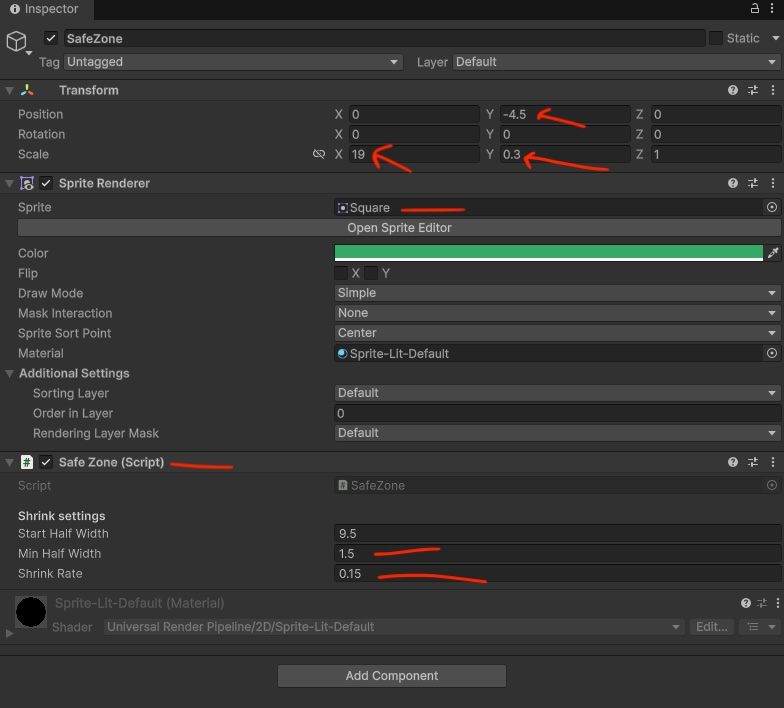

# DODGE 2D — Jahidul Arafat Edition

> **Assignment 1** | COMP 6910 Game Development | Summer 2026
> Extended from the original [Dodge2D](https://github.com/ajariwala1/Dodge2D) project

---

## Developer

| | |
|---|---|
| **Name** | Jahidul Arafat |
| **Title** | PhD Student, Department of CSSE |
| **Fellowship** | Presidential and Woltosz Graduate Research Fellow |
| **Industry** | Former L3 Senior Solution Architect (MLOps), Oracle (Singapore) |

---

## Gameplay Demo

[](https://youtu.be/tb55bFR2Fv8)

> *Click the thumbnail above to watch the gameplay demo on YouTube*

---

## How to Play

| Key | Action |
|-----|--------|
| ← / A | Move left |
| → / D | Move right |
| SPACE | Start / Restart |

---

## Grading Checklist

| Criterion | Requirement | Implementation | Status | Points |
|-----------|-------------|----------------|--------|--------|
| **Core Gameplay** | Player movement, spawning, collision | `PlayerMovement.cs`, `Spawner.cs`, `FallingObject.cs` | ✅ | 25 |
| **Score Counter** | Track and display score | Time-based score via `OnGUI`, resets on restart | ✅ | - |
| **Game Over Screen** | Show on death | Full overlay with final score via `OnGUI` | ✅ | 25 |
| **Restart System** | Restart after game over | SPACE → `SceneManager.LoadScene(0)` | ✅ | - |
| **Additional Feature** | One from the list | All 5 implemented (see below) | ✅ | 35 |
| **Polish & Presentation** | Complete, responsive, organized | Auburn bg, HUD, tooltips, labels, instructions | ✅ | 15 |
| | | | **Total** | **100** |

---

## Additional Features (All 5 Implemented)

| Feature | How It Works |
|---------|-------------|
| **Multiple Obstacle Types** | 5 types: Standard, Fast, Zigzag, Heavy, Tiny — each with unique colour, speed, size, and per-type counter (W#1, F#1, Z#1...) |
| **Different Falling Speeds** | Fast=2×, Tiny=1.4×, Zigzag=0.85×, Heavy=0.55× base speed. Spawn rate also increases with score |
| **Extra Life System** | 3 lives shown top-left. Each hit = -1 life + 2s invincibility window. Player blinks + tooltip shows countdown |
| **Shrinking Safe Area** | Green bar at bottom shrinks over time. Flashes red near edge. Shows `Survived: Xs \| Safe Zone: X% remaining` |
| **Random Obstacle Sizes** | Heavy=1.5×, Tiny=0.4×, Fast=0.6× scale — applied at runtime, same prefab |

---

## Obstacle Types

| Label | Colour | Speed | Size | Appears |
|-------|--------|-------|------|---------|
| W#n | Bright Orange | 1× | 1× | Always |
| F#n | Dark Red-Orange | 2× | 0.6× | After 10s |
| Z#n | Cyan | 0.85× | 1× | After 20s |
| H#n | Purple | 0.55× | 1.5× | After 35s |
| T#n | Yellow | 1.4× | 0.4× | After 35s |

---

## Setup

> Same wiring as original project — only 2 new steps

1. Copy all `.cs` files into `Assets/`




2. Tag **FallingObject** prefab → `Obstacle`



3. Tag **Player** GameObject → `Player` ← new



4. Create **SafeZone**: 2D Sprite Square, Y=`-4.5`, Scale X=`19` Y=`0.3`, green color, add `SafeZone` component ← new



6. *(Optional)* Add background: put image in `Assets/Resources/` named `background`, attach `BackgroundLoader` to any GameObject

---

## File Structure

```
Assets/
├── BackgroundLoader.cs   — auto-loads background image from Resources/
├── FallingObject.cs      — 5 types, speeds, sizes, per-type counters
├── FallingObject.prefab
├── GameManager.cs        — score, lives, game over, restart, instruction screen
├── ObstacleType.cs       — shared enum
├── PlayerMovement.cs     — movement, extra lives, invincibility, tooltip, label
├── SafeZone.cs           — shrinking boundary, warning flash, survival text
├── Spawner.cs            — timed spawning, difficulty ramp, weighted selection
└── Scenes/
    └── SampleScene.unity
```

---

## Technical Notes

- All UI drawn via `OnGUI()` — no extra Canvas wiring needed beyond original project
- Zigzag uses `Rigidbody2D.MovePosition()` in `FixedUpdate()` for reliable collision detection
- Safe zone boundary triggers with a 2.1s cooldown — prevents multi-life drain in one crossing
- Background scales dynamically to fill any screen size via `Camera.orthographicSize`
- Obstacle counters reset via `Spawner.Start()` → `FallingObject.ResetAllCounters()` on every scene load